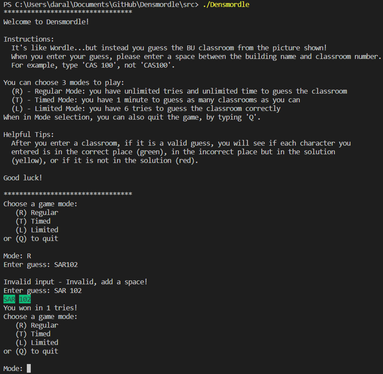
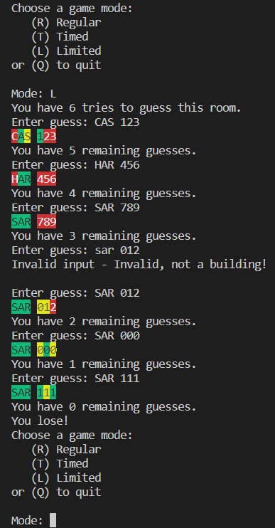
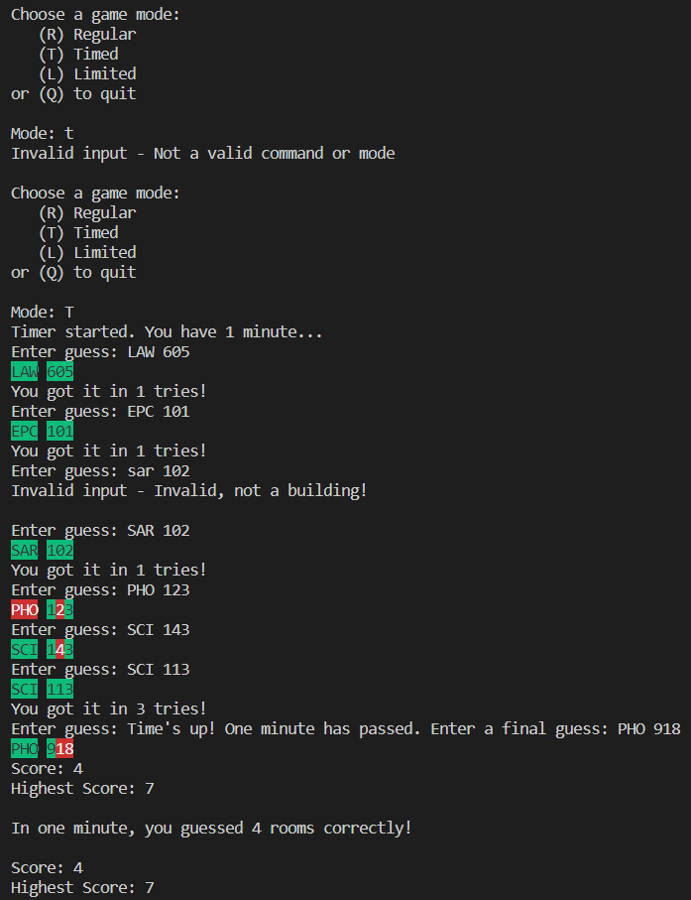

# Densmordle

## Team:
Leyandra Burke, Damla Duendar, Melissa Ferranti, Daralyn Wen

## How to Play
It's like the game "Wordle" but instead, you're guessing classrooms at BU, with a picture of the classroom as a hint.

The player is prompted with a picture of a random classroom on the Charles River BU campus with a capacity of over 80 people, as well as a spot to input their guess of three characters and three integers -- respectively corresponding to the classroom and room number. Based on the photo displayed, the user can input their guess until their guess is correct. If the correct character or integer is in the correct spot, then it appears green. If the correct character or integer is in the wrong spot, then it appears yellow. If the character or integer is not at all in the classroom’s ID, it appears red. After the user has guessed correctly, the number of total guesses is displayed.

## How to build Densmordle
A makefile was created. You should be able to type "make" to compile the files, then type "./Densmordle.exe" to play the game.

This game runs in C++ (note that it includes <windows.h>). 

## Link to Video
https://drive.google.com/file/d/1nHuQl2dIVCzKQ1WOmxQPOMbQuLp4saSS/view?usp=share_link
### Video description:
Densmoredle is a game like Wordle, but instead, you're guessing BU classrooms! After you guess, it will show you which characters are in the solution and in the correct place (green), in the solution and in the incorrect place (yellow), or not in the solution at all (red). You can play in 3 different modes: Regular Mode, Limited Mode and Timed Mode.

### Code Examples:
#### Regular Mode
This shows an example of the beginning of the game and playing Regular Mode. It also shows the message when user enters a guess without a space between the building name and classroom number.

#### Limited Mode
This is an example of the user losing the game in Limited Mode. You can get a good sense of what the colors show (not in the solution, in the solution but in an incorrect place, or in the solution in the correct place). It also shows the error message when a building entered is not an appropriate abbreviation for a building.

 

#### Timed Mode
This is an example of the user playing in Timed Mode. It is unclear from the image, but each time the user guesses correctly, a new image is opened in the browser. After the time is up, the user has one more guess, then the score is displayed. A .txt file keeps track of the user's highest score and displays the score (and changes it if necessary).

